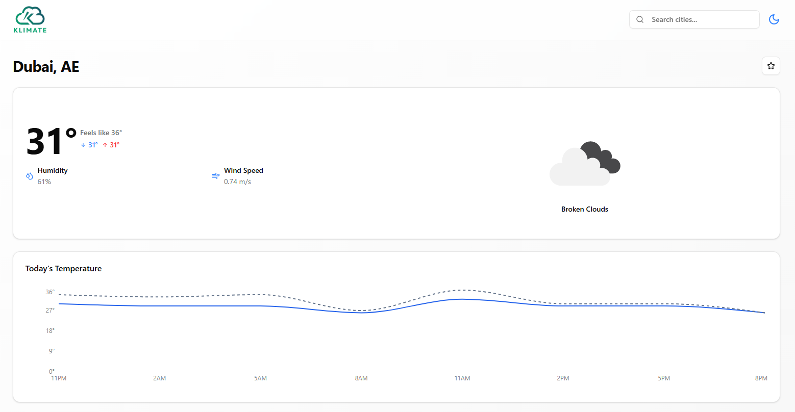
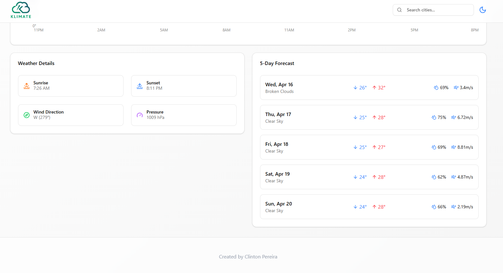
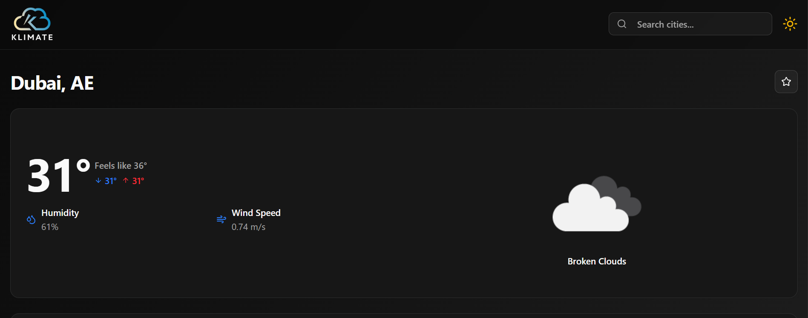
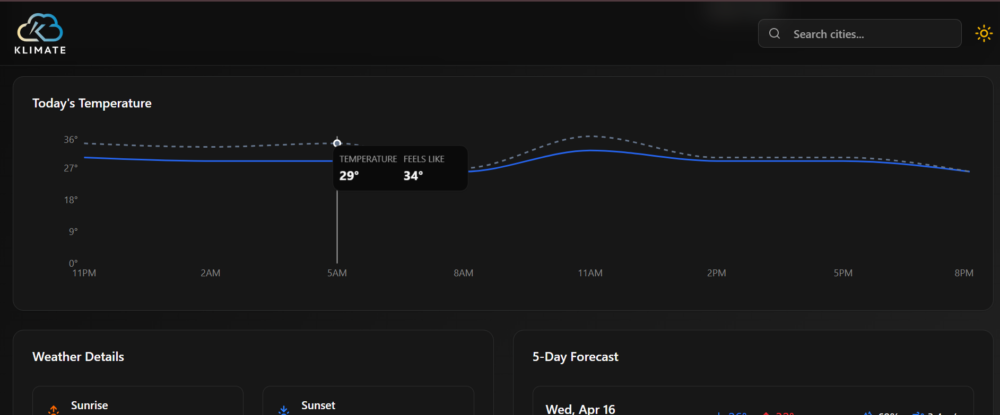
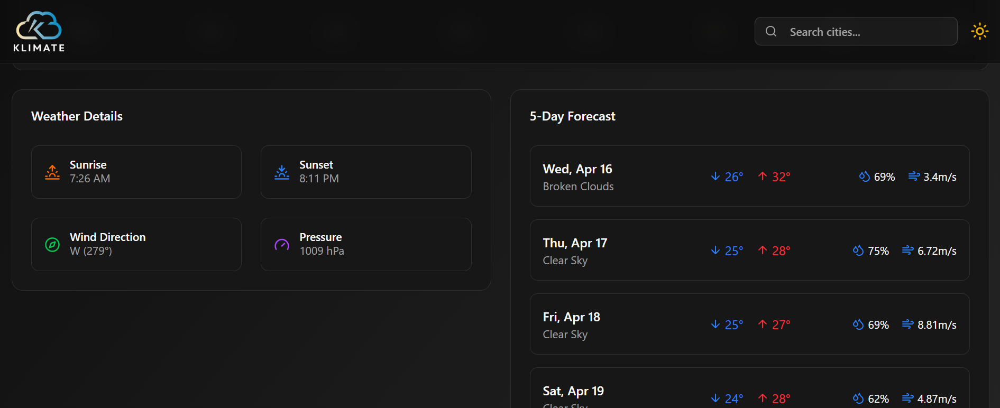
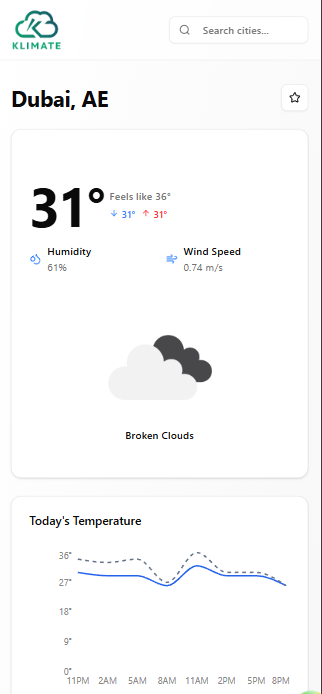
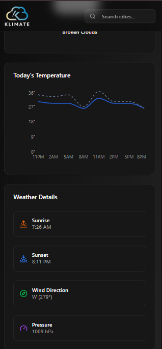

# Klimate

Klimate is a sleek and responsive weather forecasting application built using React and TypeScript. It fetches real-time weather data from the OpenWeather API and provides users with a modern, interactive interface built with ShadCN UI and Recharts. Key features include dark mode, add to favorites, and intuitive weather visualizations.

## Features

- 🌐 **Real-time Weather Data**: Get up-to-date weather information using the OpenWeather API.
- 🌓 **Dark Mode**: Toggle between light and dark themes for a comfortable viewing experience.
- ⭐ **Favorites**: Save and manage your favorite cities for quick access.
- 📱 **Responsive Design**: Optimized layout across desktops, tablets, and mobile devices.
- 🧩 **Modular UI**: Styled using ShadCN
- 🔒 **Type Safety**: Developed entirely in TypeScript for robust and maintainable code.

---

## Live Demo

Check out the live app: [Klimate](https://movieflix-project.netlify.app)

---

## Tech Stack

- **React**: UI library for building declarative interfaces.

- **TypeScript**: Superset of JavaScript for type-safe development.

- **Vite**: Lightning-fast dev server and build tool.

- **ShadCN UI**: Prebuilt accessible components built on Radix and Tailwind CSS.

- **Recharts**: Charting library for rendering responsive and customizable weather graphs.

- **OpenWeather API**: Source of weather data including temperature, wind, and humidity.

- **React Router**: Handles routing and navigation.

- **LocalStorage**: Used for persisting user favorites and preferences.

---

## Installation

1. **Clone the Repository**:
   ```bash
   https://github.com/clinton15/klimate.git
   ```
2. **Navigate to the Project Directory:**
   ```bash
   cd klimate
   ```
3. **Install the dependencies**:
   ```bash
   npm install
   ```
4. **Set Up Environment Variables:**
   - Create a .env file in the root directory.
   - Add the following variable:
   ```bash
   VITE_OPENWEATHER_API_KEY=your_openweather_api_key
   ```
5. **Start the Development Server:**
   ```bash
   npm run dev
   ```

---

### Screenshots

#### Light Mode:




#### Dark Mode:





#### Mobile View:




---

### Learnings

- **API Integration**: Consuming OpenWeather API with error handling.

- **Theming**: Implementing dark mode using Tailwind and ShadCN’s theme utilities.

- **State Management**: Managing local favorites using React state and localStorage.

- **Accessibility**: Ensured via ShadCN’s prebuilt accessible components.

---

### Future Enhancements

- **Weather Alerts**: Integrate OpenWeather alerts for severe weather warnings.

- **PWA Support**: Enable offline access and installability.

---

### Useful resources

- [ShadCN UI](https://vite.dev/)
- [Recharts](https://recharts.org/)
- [OpenWeather API Docs](https://openweathermap.org/api)
- [Tailwind CSS](https://tailwindcss.com/docs)
- [TypeScript](https://www.typescriptlang.org/)
- [React Router](https://reactrouter.com/)

---

## Author

- [Clinton Pereira](https://clinton-pereira-portfolio.vercel.app/)
- [GitHub](https://github.com/clinton15)
- [LinkedIn](https://www.linkedin.com/in/clinton-pereira-05a410185/)
